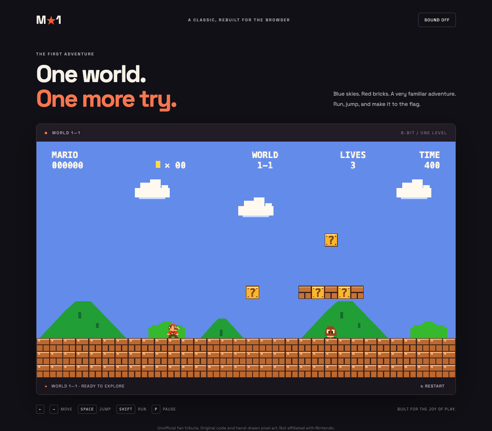

# Super Mario · One Level

A playable browser fan tribute to the first Super Mario Bros. level: blue skies, pixel scenery, brick and question blocks, pipes, Goombas, three lives, gaps, stairs, a flagpole, and a castle. The layout is inspired by World 1-1, with original hand-drawn canvas art and a compact single-level ruleset; it is not an exact reproduction.

## Play

Open `index.html` in a modern browser. No build or dependencies are needed. For a local web server, run `python3 -m http.server 8000` in this directory and visit http://localhost:8000.

- **Left / right** or **A / D**: move
- **Space**, **W**, or **up**: jump; release early for a shorter jump
- **Shift**: run
- **P**: pause / resume
- **Enter**: start or replay
- On touch devices, use the buttons below the game.

Hit question blocks from below for coins. Jump on enemies to defeat them. Reach the flag to finish. Restart resets the game; losing a life resets the level while retaining your score and collected coin count. Sound effects are synthesized locally and can be enabled with the sound button.

## Implementation

Plain HTML, CSS, and JavaScript. Fixed-step physics, axis-separated collisions, jump buffering, coyote time, a scrolling camera, keyboard and pointer controls, generated sound effects, pause, and replay. All game art is drawn in code. An optional Google Fonts stylesheet enhances the surrounding page; system fonts work offline.

This is an unofficial fan tribute, not affiliated with or endorsed by Nintendo. Super Mario and related characters are Nintendo properties. No original game files, music, or extracted sprites are included.
